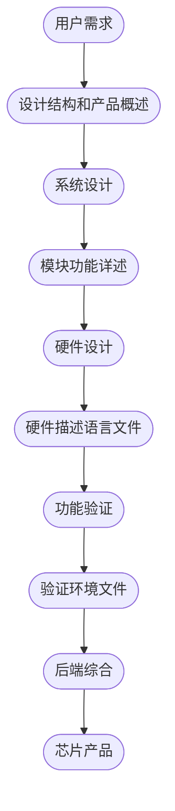

+++
archetype = "chapter"
title = "跟着路桑学SystemVerilong"
weight = 10

+++

## 芯片开发流程

- 系统设计人员按照功能划分为各个子系统
- 子系统被进一步划分为功能模块，并由设计团队实现
- 验证人员对设计功能展开验证，发现设计缺陷，交由设计人员修正
- 验证没有出现漏洞后，交由后端人员进行综合、布局、布线
- 后端人员将核心数据交由FAB进行流片

## 验证岗位重要性

- 验证需求量更大，与设计比例接近2:1，甚至更高
- 了解验证知识对于将来从事设计或者验证都有帮助
- 验证职业日益趋向软件化，知识迭代的半衰期比设计更短

## 动态验证技术

- 依靠仿真器`simulator`来对数字电路进行激励发送和结果检查

## 静态验证技术

- 与动态验证技术完全不同
- 分为人工形式验证技术和自动形式验证技术
- 人工形式验证技术，又称属性检查，通过断言结合形式验证工具对设计功能进行穷举检查，从数学意义上判断设计的正确性
- 自动验证技术包括Soc集成连接检查，死锁检查，X语义安全检查，覆盖范围可及性分析等等

## Emulation及FPGA原型开发

- 在SoC开发中后期，进行原型开发
- 相对于仿真技术，其速度更快，而可调试性不及仿真